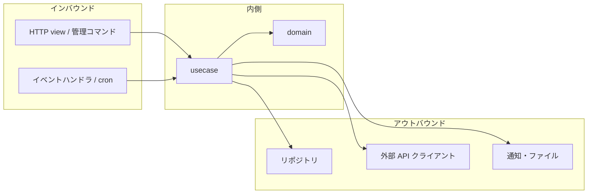

# アダプタの設計 (Adapters)

**アダプタ = 外界と内側を繋ぐ変換層。** 境界を引くかどうかの判断は
[clean-architecture-boundaries](../clean-architecture-boundaries/SKILL.md)。
ここは**引くと決めた後、アダプタをどう実装するか**。

リポジトリ(永続化アダプタ)は
[ddd-aggregate-repository-boundary](../ddd-aggregate-repository-boundary/SKILL.md)、
他コンテキストの ACL は
[ddd-bounded-context](../ddd-bounded-context/SKILL.md)。



---

## 1. インバウンド — 入口ごとの責務

**どの入口も、やることは同じ 3 つだけ。**

1. 外部の入力を **Command DTO** に変換する
2. usecase を呼ぶ
3. 結果を外部の形式に変換する

| 入口 | 固有の関心 | 共通化するもの |
| --- | --- | --- |
| **HTTP view** | 認証、ステータスコード、シリアライズ | **usecase の組み立て** |
| **管理コマンド** (`BaseCommand`) | 引数パース、標準出力、終了コード | 同上 |
| **イベントハンドラ** | 冪等性、失敗時の再送 | 同上 |
| **定期実行** (cron/Celery) | 実行間隔、多重起動の防止 | 同上 |

```python
# 同じ usecase を 3 つの入口から呼ぶ。共通化するのは組み立てだけ
# interfaces/views.py
class CancelOrderView(APIView):
    def post(self, request, order_id):
        output = build_cancel_order().execute(CancelOrderCommand(...))
        return Response(CancelOrderSerializer(output).data)

# interfaces/management/commands/cancel_order.py
class Command(BaseCommand):
    def handle(self, *args, **options):
        output = build_cancel_order().execute(CancelOrderCommand(...))
        self.stdout.write(f"取り消しました: {output.order_id}")
```

- **共通化するのは composition root(`build_xxx`)だけ**
  ([ddd-application-layer](../ddd-application-layer/SKILL.md))。
- **入口をまたぐ「共通基底クラス」を作らない。** 各入口の固有の関心(ステータス
  コード、終了コード、再送)はまったく別物で、まとめると条件分岐だらけになる。
- **入口に業務判断を書かない。** 3 つの責務以外が出てきたら usecase へ。
- **入口が増えても usecase は変わらない。** 変えたくなったら、それは
  usecase が特定の入口に依存している証拠。

---

## 2. 認証と認可の位置

**別物として扱う。** 混ぜると層が壊れる。

| | 何を決めるか | どこ | 理由 |
| --- | --- | --- | --- |
| **認証** (Authentication) | 誰か | **インバウンドアダプタ** | HTTP ヘッダ・セッションの解釈は外界の関心 |
| **認可: 操作の可否** | この役割はこの操作をしてよいか | **usecase の入口** | アプリケーションの都合。入口が変わっても同じ |
| **認可: 業務ルール** | この人はこのデータに対して何ができるか | **ドメイン** | 業務ルールそのもの |

```python
# インバウンド: 認証(誰か)を解決し、id にして渡す
class CancelOrderView(APIView):
    permission_classes = [IsAuthenticated]        # 認証はここ
    def post(self, request, order_id):
        command = CancelOrderCommand(
            order_id=order_id,
            actor_id=str(request.user.id),        # 「誰が」を内側へ渡す
        )

# usecase: 操作の可否
def execute(self, command: CancelOrderCommand) -> CancelOrderOutput:
    if not self._permissions.can(command.actor_id, "order.cancel"):
        raise PermissionDenied(...)

# ドメイン: 業務ルールとしての可否
def cancel(self, *, actor: ActorId) -> "Order":
    if self.customer_id != actor and not self.is_operator(actor):
        raise NotOrderOwner(...)      # 「自分の注文しか取り消せない」は業務ルール
```

- **`request.user` を usecase に渡さない。** Django のオブジェクトが内側へ漏れる。
  **id を渡す。**
- **「自分のデータだけ」は業務ルール**なので、ドメインが守る。view の
  `permission_classes` だけに任せると、CLI や cron から迂回できる。
- 認可の失敗は業務ルール違反ではなくアプリの都合 → `PermissionDenied` は
  アプリケーション層の例外([exception-design](../exception-design/SKILL.md))。

---

## 3. アウトバウンド — 外部 API クライアント

**抽象は使う側(usecases か domain)、実装はインフラ層。**

```python
# usecases/ports.py  ← 使う側が必要な操作だけ定義する
class CreditChecker(Protocol):
    def check(self, *, customer_id: CustomerId) -> CreditRating: ...


# infrastructure/adapters/credit_bureau.py
class CreditBureauAdapter(CreditChecker):
    def __init__(self, *, base_url: str, api_key: str, timeout: float) -> None:
        ...                                    # 設定は注入される

    def check(self, *, customer_id: CustomerId) -> CreditRating:
        try:
            res = self._session.get(..., timeout=self._timeout)
            res.raise_for_status()
        except requests.Timeout as e:
            raise CreditCheckUnavailable(...) from e      # 翻訳して投げる
        return self._to_rating(res.json())                # 自分の型へ

    def _to_rating(self, payload: dict) -> CreditRating:
        match payload["grade"]:
            case "A" | "B": return CreditRating.GOOD
            case "C":       return CreditRating.FAIR
            case _:         raise ValueError(f"未知の格付け: {payload['grade']!r}")
```

**アダプタが引き受けること:**

- **接続の詳細**(URL、認証ヘッダ、シリアライズ形式)
- **外部形式 → 自分の型への翻訳**(`_to_rating`)
- **外部の例外 → 意味のある例外への翻訳**(`raise ... from e`)
- リトライ・タイムアウト(第 4 節)

**アダプタが引き受けないこと:**

- **業務判断**(「格付け C なら断る」は usecase かドメイン)
- **トランザクション**(境界は usecase)
- **設定の読み込み**(`settings` を直接読まず、引数で受け取る)

> **未知の値を黙って既定値に落とさない。** 上の `case _: raise` が重要。
> 相手の仕様変更に気付けなくなる([ddd-bounded-context](../ddd-bounded-context/SKILL.md) の ACL)。

---

## 4. リトライ・タイムアウトはアダプタ内に閉じる

**usecase はリトライを知らない。** 知ってしまうと、業務の手順に技術的関心が混ざる。

| 関心 | どこ | 理由 |
| --- | --- | --- |
| **タイムアウト** | アダプタ | 必ず設定する。無期限待ちを作らない |
| **リトライ**(短期・同一プロセス内) | **アダプタ** | 一時的失敗の吸収は技術的関心 |
| **サーキットブレーカ** | アダプタ | 相手の障害を内側に伝播させない |
| **長期のリトライ**(数分〜数日) | **プロセスマネージャ** | 業務の関心。[ddd-long-running-process](../ddd-long-running-process/SKILL.md) |
| 冪等キーの**値** | 呼び出し側が決める | どの操作の再送かは業務が知っている |

- **タイムアウトは必ず明示する。** `requests` の既定は無期限。
- **リトライするのは「一時的失敗」だけ。** 4xx(相手が拒否)は再試行しても同じ
  ([operation-result-design](../operation-result-design/SKILL.md))。
- **副作用のある呼び出しをリトライするなら冪等キーが要る。** ないままリトライすると
  二重実行になる。相手が 429 を返したら `Retry-After` に従う。自分が API を
  提供する側での実装は [api-reliability](../api-reliability/SKILL.md)。
- **リトライの上限を超えたら、意味のある例外を投げる。** 黙って `None` を返さない。

---

## 5. 通知・メール・ファイル

**「送る」も外部依存。** usecase が `send_mail(...)` を直接呼んだら層が壊れている。

```python
class OrderNotifier(Protocol):
    def notify_cancelled(self, *, order_id: OrderId, to: Email) -> None: ...
```

- **抽象は業務の言葉で**(`send_email` ではなく `notify_cancelled`)。
  手段が変わっても(メール → SMS)、内側は変わらない。
- **送信はトランザクション確定後**。イベントハンドラから呼ぶのが素直
  ([ddd-domain-events](../ddd-domain-events/SKILL.md))。
- **本文の組み立てはアダプタ側。** テンプレートは表示の関心。
- **送信失敗を業務の失敗にしない。** 通知が飛ばなくても注文の取り消しは成立している。

---

## 6. アダプタのテスト

**実物を叩かない。** 遅く、不安定で、CI で落ちる。

| 対象 | やり方 |
| --- | --- |
| **翻訳ロジック**(`_to_rating`) | **純粋な単体テスト。** ここが本体 |
| HTTP のやり取り | **記録したレスポンスで再生**(`responses` / `respx` などでスタブ) |
| リトライ・タイムアウト | スタブでエラーを返し、**回数と挙動**を検証 |
| 相手が仕様通りか | **契約テスト**を別に用意し、CI とは分けて実行 |
| usecase 側 | アダプタの**フェイク実装**を注入([ddd-testing-strategy](../ddd-testing-strategy/SKILL.md)) |

- **翻訳とエラー変換を必ずテストする。** アダプタのバグはほぼここに出る。
- **未知の値で例外になること**をテストする。相手の仕様変更を検出する唯一の手段。
- **フェイクは抽象(Protocol)を実装する。** 抽象を変えたらフェイクも壊れる = 乖離しない。
- 実物を叩くテストを書くなら、**通常の CI から外す**(手動 or 日次)。

---

## アンチパターン

| アンチパターン | なぜ悪いか |
| --- | --- |
| 入口ごとに業務ロジックを書く | HTTP と CLI で挙動がズレる |
| 入口をまたぐ共通基底クラスを作る | 固有の関心が違いすぎ、条件分岐だらけになる |
| `request.user` を usecase に渡す | Django のオブジェクトが内側へ漏れる。id を渡す |
| 認可を view の `permission_classes` だけに任せる | CLI / cron / イベント経由で迂回できる |
| 「自分のデータだけ」をアダプタで判定する | 業務ルールがドメインの外に出る |
| usecase がリトライを知っている | 業務の手順に技術的関心が混ざる |
| タイムアウトを設定しない | 相手の停止でこちらのワーカーが枯渇する |
| 副作用のある呼び出しを冪等キーなしでリトライ | 二重実行になる |
| 4xx をリトライする | 何度やっても同じ。無駄に待つ |
| 外部の未知の値を既定値に落とす | 相手の仕様変更に気付けない |
| アダプタが `settings` を直接読む | 差し替え不能。引数で受け取る |
| アダプタに業務判断を書く | 「格付け C なら断る」は usecase かドメイン |
| 外部レスポンスの dict をそのまま内側へ渡す | 相手の形が内側に侵入する |
| 通知の失敗で業務処理を失敗させる | 通知が飛ばなくても取り消しは成立している |
| CI で実物の外部 API を叩く | 遅く不安定。相手の障害で自分の CI が落ちる |

---

## ルール(チェックリスト)

- [ ] 入口の責務が「**DTO へ変換 → usecase → 外部形式へ変換**」の 3 つだけ
- [ ] 入口をまたぐ共通化が **composition root だけ**(共通基底クラスを作っていない)
- [ ] **認証はアダプタ、操作の可否は usecase、業務ルールとしての可否はドメイン**
- [ ] `request.user` ではなく **id** を内側へ渡している
- [ ] 「自分のデータだけ」をドメインが守っている(入口を迂回できない)
- [ ] アウトバウンドの抽象を**使う側**が定義し、実装がインフラ層にある
- [ ] アダプタが**外部形式を自分の型に翻訳**している(dict を内側へ渡していない)
- [ ] **未知の値で例外**になる(既定値に落としていない)
- [ ] 外部の例外を **`raise ... from e`** で翻訳している
- [ ] **タイムアウトを必ず設定**している
- [ ] リトライ・サーキットブレーカが**アダプタ内に閉じて**いる(usecase が知らない)
- [ ] 副作用のある再送に**冪等キー**がある
- [ ] 長期のリトライは**プロセスマネージャ**の側にある
- [ ] 通知の抽象が**業務の言葉**で、送信失敗が業務の失敗になっていない
- [ ] アダプタが `settings` を直接読まず、**設定を引数で受け取る**
- [ ] **翻訳とエラー変換の単体テスト**があり、未知の値のケースを含む
- [ ] CI で**実物の外部 API を叩いていない**(契約テストは分離)
