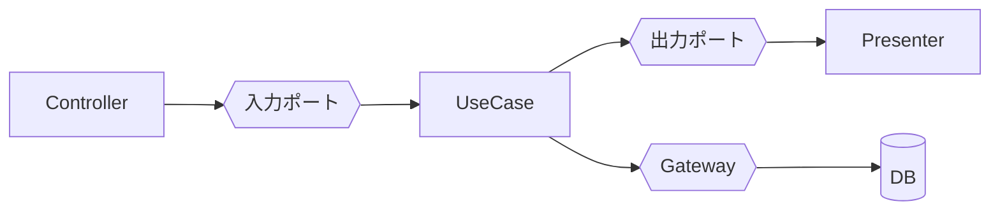

# アーキテクチャの境界 (Boundaries)

**境界を引くべきか、引くならどの強度か。** ユースケースの中身と層の依存方向は
[ddd-application-layer](../ddd-application-layer/SKILL.md) が扱う。ここは
**境界そのものの設計判断**と、そこにしか出てこない部品(出力ポート・Presenter・
Humble Object)を扱う。

原則としての依存性逆転は [solid-principles](../solid-principles/SKILL.md)、
モジュール間の依存グラフは [component-design](../component-design/SKILL.md)。

---

## 1. 境界にはコストがある

**境界を引くと、必ず次を払う。**

- 間接化(実装を追うのにファイルが増える)
- データの詰め替え(DTO の往復)
- 抽象の維持(実装が 1 つでも抽象を直す)

**払う価値があるのは、境界の両側が別々の理由で変わるときだけ。**

| 状況 | 判断 |
| --- | --- |
| DB を差し替える可能性が実在する | 引く |
| 外部 API が自分の都合と無関係に変わる | 引く(ACL) |
| テストで差し替えたい | 引く |
| フレームワークを business logic から隔離したい | 引く |
| 「いつか変わるかもしれない」 | **引かない** |
| 実装が 1 つで、差し替えた実績もテストでの差し替えもない | **引かない** |

**判断を先送りできるのが境界の価値。** 逆に言えば、**先送りしたい決定がないなら
境界は要らない。**

---

## 2. 境界には強度の段階がある

**「引く / 引かない」の二択ではない。** 弱い境界から始めて、必要になったら強める。

| 強度 | 形 | コスト | いつ |
| --- | --- | --- | --- |
| 1. **分離しない** | 直接呼ぶ | なし | 既定。まずここ |
| 2. **関数・クラスを分ける** | 呼び出し先を切り出すだけ | ほぼなし | 責務が違うと分かった |
| 3. **一方向の境界** | 具象に直接依存するが、依存の向きは固定 | 小 | 層を作りたいが差し替えは不要 |
| 4. **完全な境界** | 抽象(Protocol/ABC)+ 注入 | 中 | 差し替える / テストで差し替える |
| 5. **プロセス分離** | 別サービス・別リポジトリ | 大 | 独立デプロイが必要 |

**段階 3 で足りることが非常に多い。** 「usecase から Django モデルを直接触らない」
だけでも、依存の向きは固定できる。抽象を作るのは段階 4 に進むと決めたとき。

**後から強められるように書く。** 呼び出し箇所が 1 か所にまとまっていれば、
段階 3 → 4 は機械的に上げられる。

---

## 3. 入力ポートと出力ポート

境界を越える通信は、**呼ぶ側が定義したインターフェース**を通す。



| 部品 | 責務 | 実装場所 |
| --- | --- | --- |
| **Controller** | 外部入力を Command DTO に変換する。それだけ | interfaces |
| **入力ポート** | usecase を呼ぶための口 | usecases |
| **出力ポート** | usecase が結果を渡す先の抽象 | usecases |
| **Presenter** | 出力 DTO を表示形式に変換する | interfaces |
| **Gateway** | 永続化・外部 API の抽象(= リポジトリ) | 抽象は内側、実装は外側 |

- **入力ポートは、Python では usecase クラスそのもので足りる。** `PlaceOrderInputPort`
  という抽象を別途作るのは、**usecase を差し替える実績があるときだけ**。
  通常は過剰。
- **Gateway = リポジトリ**。設計は
  [ddd-aggregate-repository-boundary](../ddd-aggregate-repository-boundary/SKILL.md)。
- **各アダプタの実装**(入口ごとの責務、外部 API クライアント、リトライの置き場所、
  認証と認可の位置)は [adapter-design](../adapter-design/SKILL.md)。
- **Controller に業務判断を置かない。** 変換だけ。

---

## 4. Presenter と出力ポート — 使う場合と使わない場合

**usecase が戻り値を返す方式**(既定)と、**出力ポートに渡す方式**がある。

```python
# 方式 A(既定): 戻り値を返す。呼び出し側が表示を決める
class PlaceOrder:
    def execute(self, command: PlaceOrderCommand) -> PlaceOrderOutput: ...

# 方式 B: 出力ポートに渡す。usecase は戻り値を持たない
class PlaceOrderOutputPort(Protocol):
    def present_success(self, output: PlaceOrderOutput) -> None: ...
    def present_conflict(self, reason: str) -> None: ...


class PlaceOrder:
    def __init__(self, orders: OrderRepository, presenter: PlaceOrderOutputPort) -> None: ...
    def execute(self, command: PlaceOrderCommand) -> None:
        ...
        self._presenter.present_success(output)
```

**Django / DRF では方式 A を既定にする。**

| | 方式 A(戻り値) | 方式 B(出力ポート + Presenter) |
| --- | --- | --- |
| 依存の向き | usecase → 何も知らない | usecase → 抽象(実装は外側) |
| 素直さ | **高い**。普通の関数呼び出し | 低い。制御が反転して追いにくい |
| 向くとき | HTTP レスポンスを 1 つ返すだけ | **同じ usecase の結果を複数の形式へ**同時に出す |
| 向くとき | | 結果の**種類ごとに表示が大きく違う**(成功/競合/部分成功) |

- **DRF は serializer が既に Presenter の役割**を持っている。二重に作らない。
- 方式 B が効くのは、CLI と HTTP と WebSocket に同じ usecase を出す場合など。
  **その予定がないなら方式 A。**
- 方式 A でも**依存性のルールは守れている**(usecase は DRF を知らない)。
  Presenter がないこと自体は違反ではない。

**「Clean Architecture の図に Presenter があるから作る」は理由にならない。**

---

## 5. Humble Object — テストできない部分を薄くする

**テストしにくいもの(UI・フレームワーク・DB・外部 API)は、
「何も判断しない薄い層」に押し出す。** 判断はテスト可能な側に置く。

```python
# NG: view に判断が入っていて、テストに HTTP が必要
class OrderView(APIView):
    def post(self, request):
        if request.data["quantity"] > 100:        # ← 業務判断
            return Response({"error": ...}, status=400)
        ...

# OK: view は変換とディスパッチだけ(humble)。判断は usecase / ドメイン
class OrderView(APIView):
    def post(self, request):
        command = PlaceOrderCommand(**serializer.validated_data)
        output = self.place_order.execute(command)
        return Response(PlaceOrderResponseSerializer(output).data, status=201)
```

- **薄い側はテストしない。** 判断がないので、テストしても何も検証できない。
- **境界を越えるのは単純なデータ構造**(dataclass / dict)。ORM オブジェクトや
  `Request` を渡さない。
- 同じ考えで、リポジトリ実装も「マッピングだけ」にする。判断が混ざったら
  ドメインへ戻す。
- 層ごとのテスト方針は
  [ddd-testing-strategy](../ddd-testing-strategy/SKILL.md)。

**検出**: 「この view / serializer をテストしたい」と思ったら、
**そこに判断が漏れている**。

---

## 6. Django / DRF での落とし所

現実的な構成。**すべての境界を段階 4 にしない。**

| 境界 | 推奨強度 | 理由 |
| --- | --- | --- |
| view ↔ usecase | 3(一方向) | view が usecase を直接 new してよい。差し替え不要 |
| usecase ↔ リポジトリ | **4(完全)** | テストで差し替える。DB を外せる価値が大きい |
| usecase ↔ 外部 API | **4(完全)** | 相手の都合で変わる。ACL を挟む |
| usecase ↔ Presenter | 1〜2(作らない) | serializer で足りる |
| ドメイン ↔ 全部 | 4(何も依存しない) | ここだけは妥協しない |

- **`urls.py` → `views.py` → `usecases/` → `domain/`** の一方向が保てていれば、
  Clean Architecture の目的(業務ルールをフレームワークから守る)はほぼ達成できる。
- 迷ったら**内側(ドメイン)を厳しく、外側を緩く**。
- 検証は grep でできる(
  [component-design](../component-design/SKILL.md))。

---

## アンチパターン

| アンチパターン | なぜ悪いか |
| --- | --- |
| 図に描かれているから全部の部品を作る | 使わない間接化のコストだけ払う |
| すべての境界を「完全な境界」にする | 実装 1 つの抽象が量産され、追跡不能になる |
| 実装が 1 つで差し替え実績もない抽象 | 先送りしたい決定がないのに境界を引いている |
| Controller に業務判断を書く | テストに HTTP が必要になる。判断は内側へ |
| view / serializer をテストしたくなる | そこに判断が漏れている証拠 |
| 境界を越えて ORM オブジェクトを渡す | 遅延読み込みとフレームワーク依存が越境する |
| DRF の serializer とは別に Presenter を作る | 二重の変換層。片方で足りる |
| 出力ポートを使うが実装が 1 つ | 制御が反転しただけで、得るものがない |
| 「いつか変わるかも」で境界を引く | 起きていない変更にコストを払う |
| 境界の強度を最初から最大にする | 段階的に上げられる設計にしておけばよい |

---

## ルール(チェックリスト)

- [ ] 各境界について「**先送りしたい決定**」を言える(言えないなら引かない)
- [ ] 境界の強度を**段階で選んだ**。全部を完全な境界にしていない
- [ ] 実装が 1 つで、差し替え実績もテストでの差し替えもない抽象がない
- [ ] **ドメインへの境界だけは妥協していない**(何にも依存していない)
- [ ] usecase ↔ リポジトリ / 外部 API は**完全な境界**(テストで差し替えられる)
- [ ] Controller が**変換とディスパッチだけ**をしている(業務判断がない)
- [ ] view / serializer に「テストしたくなる判断」が漏れていない
- [ ] 境界を越えるのが**単純なデータ構造**(ORM オブジェクト・`Request` を渡していない)
- [ ] Presenter / 出力ポートを、**複数の出力形式が実在する場合だけ**使っている
- [ ] DRF の serializer と Presenter を二重に作っていない
- [ ] 依存の向きが `urls → views → usecases → domain` の一方向で、grep で検証できる
