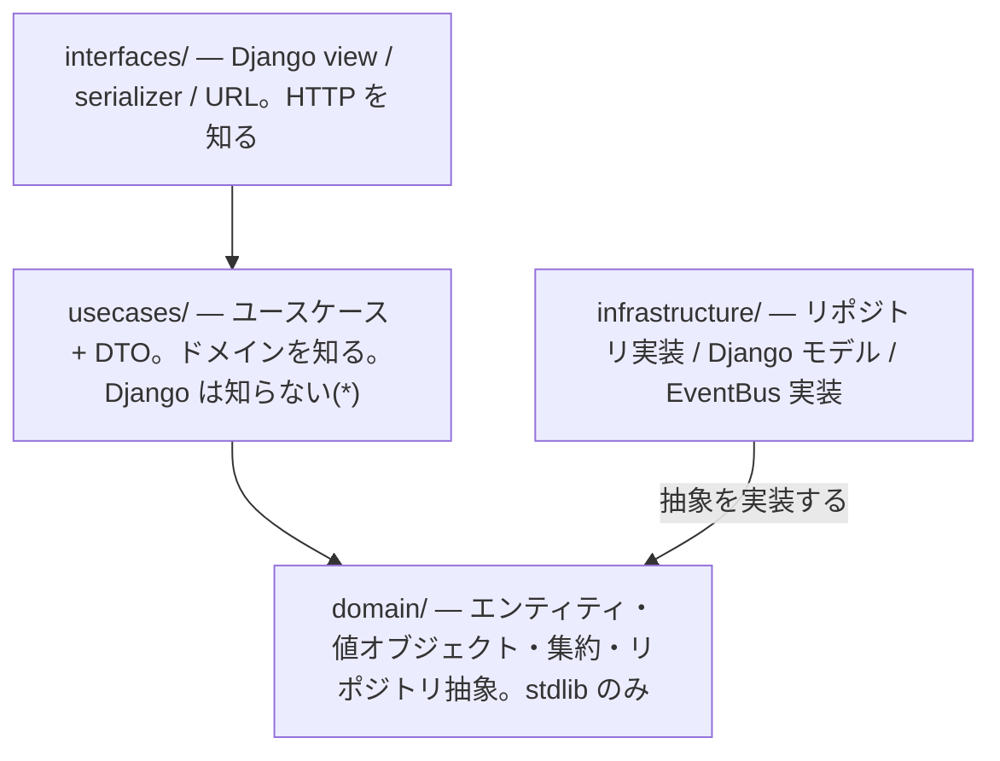

# DDD: アプリケーション層 (Application Layer / Use Cases)

**ドメインを組み立てるだけの薄い層。** ここにビジネスルールが溜まると、ドメイン層は
貧血になり、DDD の他のすべてが崩れる。

前提: Python 標準ライブラリの `dataclasses`。ドメイン層は **stdlib のみ**に依存する。
アプリケーション層はドメイン層に依存してよいが、**Django には依存しない**
(トランザクション制御を除く。第 3 節)。

集約とリポジトリ抽象は
[ddd-aggregate-repository-boundary](../ddd-aggregate-repository-boundary/SKILL.md)、
ドメインオブジェクトの設計は
[ddd-domain-object-completeness](../ddd-domain-object-completeness/SKILL.md)、
イベントのディスパッチは
[ddd-domain-events](../ddd-domain-events/SKILL.md)、
読み取り専用の処理は
[ddd-read-model-cqrs](../ddd-read-model-cqrs/SKILL.md)、
テストの書き方は
[ddd-testing-strategy](../ddd-testing-strategy/SKILL.md)、
トランザクションや signals など Django 固有の落とし穴は
[ddd-django-pitfalls](../ddd-django-pitfalls/SKILL.md)、
既存の `XxxService` を解体する手順は
[ddd-legacy-refactoring](../ddd-legacy-refactoring/SKILL.md)。
**そもそもその境界を引くべきか**、Presenter / 出力ポートを導入するかの判断は
[clean-architecture-boundaries](../clean-architecture-boundaries/SKILL.md)、
原則としての依存性逆転は
[solid-principles](../solid-principles/SKILL.md)。

---

## 1. 責務: 組み立てるだけ

アプリケーション層がやってよいことは、**この 5 つだけ**。

| やること | 例 |
| --- | --- |
| リポジトリから集約を取得する | `order = self._orders.find_by_id(order_id)` |
| ドメインの振る舞いを**1 回**呼ぶ | `cancelled = order.cancel()` |
| リポジトリで保存する | `self._orders.save(cancelled)` |
| イベントをディスパッチする | `self._bus.publish(event)` |
| ドメインオブジェクトを DTO に詰め替えて返す | `return CancelOrderOutput.from_domain(...)` |

やってはいけないこと:

- **業務ルールの判断**(`if order.status == "shipped": raise ...`)。それは集約の中。
- **フィールド単位の状態変更**(`order.status = CANCELLED`)。意図を表すメソッド 1 つに置き換える。
- **複数集約の同時更新**。1 トランザクション = 1 集約
  ([ddd-aggregate-repository-boundary](../ddd-aggregate-repository-boundary/SKILL.md))。
- **表示のための整形**(通貨記号、日付フォーマット、i18n)。それはインターフェース層。

### 判定基準

usecase 内の `if` / ループ / 計算を見て、**それがドメインの言葉で説明できるなら**
ドメイン層に属している。「出荷済みなら取り消せない」はドメインの言葉。
「集約が見つからなければ 404 用の例外を投げる」はアプリケーションの言葉。

---

## 2. 1 ユースケース = 1 クラス = 1 public メソッド

```python
from dataclasses import dataclass


class CancelOrder:
    def __init__(self, orders: OrderRepository, bus: EventBus) -> None:
        self._orders = orders
        self._bus = bus

    def execute(self, command: CancelOrderCommand) -> CancelOrderOutput:
        order = self._orders.find_by_id(OrderId(value=command.order_id))
        if order is None:
            raise OrderNotFound(command.order_id)

        cancelled = order.cancel(reason=CancellationReason(value=command.reason))
        drained, events = cancelled.pull_events()

        self._orders.save(drained)
        for event in events:
            self._bus.publish(event)

        return CancelOrderOutput.from_domain(drained)
```

- **クラス名は動詞句**(`CancelOrder` / `PlaceOrder` / `RegisterCustomer`)。
  `OrderService` のような名詞の「なんでも屋」を作らない — メソッドが際限なく増える。
- public メソッドは 1 つ(`execute` / `__call__`)。名前はプロジェクト内で統一する。
- **`XxxService` に複数のユースケースを詰めない。** 依存が合算され、どのメソッドが
  何を必要とするのか分からなくなる。

---

## 3. トランザクション境界はユースケース

**トランザクションを開始・確定する場所は usecase の 1 か所だけ。**

- ドメイン層はトランザクションを知らない。`django.db` を import しない。
- リポジトリ実装は、渡された集約を保存するだけ。**リポジトリが独自にコミットしない。**
- view / serializer でトランザクションを張らない。境界が二重になる。

```python
from django.db import transaction


class CancelOrder:
    def execute(self, command: CancelOrderCommand) -> CancelOrderOutput:
        with transaction.atomic():
            order = self._orders.find_by_id(...)
            ...
            self._orders.save(drained)
            # 確定後にディスパッチ(ロールバックされたら飛ばない)
            for event in events:
                transaction.on_commit(lambda e=event: self._bus.publish(e))
        return CancelOrderOutput.from_domain(drained)
```

> `django.db.transaction` を usecase に直接書くか、`UnitOfWork` 抽象で包むかは選択。
> 包む場合も**抽象はアプリケーション層、実装はインフラ層**にする。
> どちらにせよ「境界は usecase」は動かない。

イベントのディスパッチ順序の詳細は
[ddd-domain-events](../ddd-domain-events/SKILL.md)。

---

## 4. 入出力は DTO — ドメインオブジェクトを外に出さない

usecase の**入口と出口の両方**を DTO で塞ぐ。これが層の境界の実体。

```python
from dataclasses import dataclass


@dataclass(frozen=True, kw_only=True)
class CancelOrderCommand:
    """入力。プリミティブで受け、usecase 内で値オブジェクトに変換する。"""

    order_id: str
    reason: str


@dataclass(frozen=True, kw_only=True)
class CancelOrderOutput:
    """出力。ドメインオブジェクトそのものを返さない。"""

    order_id: str
    status: str
    cancelled_at: datetime

    @classmethod
    def from_domain(cls, order: Order) -> "CancelOrderOutput":
        return cls(
            order_id=str(order.id),
            status=order.status.value,
            cancelled_at=order.cancelled_at,
        )
```

- **入力 (Command / Input DTO)**: `frozen` な dataclass。プリミティブで受け取り、
  usecase の中で値オブジェクトへ変換する。変換で `ValueError` が出るのは正常な経路
  (第 6 節で HTTP に変換する)。
- **出力 (Output DTO)**: usecase が集約を返すと、呼び出し側が `order.cancel()` を
  呼べてしまい、**トランザクション境界の外でドメインの振る舞いが動く**。必ず塞ぐ。
- **serializer / request オブジェクトを usecase に渡さない。** アプリケーション層が
  Django REST Framework に依存すると、テストに HTTP が要るようになる。

```python
# NG: view の関心が usecase に侵入している
def execute(self, request: Request) -> Response: ...

# OK: フレームワークを知らない
def execute(self, command: CancelOrderCommand) -> CancelOrderOutput: ...
```

---

## 5. 依存性注入と composition root

usecase は**抽象だけ**をコンストラクタで受け取る。自分で具象を作らない。

```python
# NG: 具象を自分で組み立てている(差し替え不能・テスト不能)
class CancelOrder:
    def __init__(self) -> None:
        self._orders = DjangoOrderRepository()

# OK: 抽象を受け取る
class CancelOrder:
    def __init__(self, orders: OrderRepository, bus: EventBus) -> None: ...
```

- 具象の選択は **composition root 1 か所**に閉じる。
- テストでは in-memory 実装を差し込む。**usecase のテストに DB は要らない**
  ([ddd-testing-strategy](../ddd-testing-strategy/SKILL.md))。
- インフラを呼ぶ副作用(メール送信、外部 API)も抽象にする。usecase が
  `requests.post(...)` を直接書いたら、それはインフラ層の漏れ。

### composition root の実装

**ファクトリ関数から始める。** DI コンテナは、これで足りなくなってから。

```python
# infrastructure/factories.py  ← ここが composition root
def build_cancel_order() -> CancelOrder:
    return CancelOrder(DjangoOrderRepository(), DjangoEventBus())


# interfaces/views.py
class CancelOrderView(APIView):
    def post(self, request, order_id):
        usecase = build_cancel_order()          # 具象を知るのはここだけ
        output = usecase.execute(CancelOrderCommand(...))
```

- **`infrastructure/` に置く。** ここだけが全層を知ってよい。`usecases/` や
  `domain/` にファクトリを置くと、内側が外側を import することになる。
- **view に `DjangoOrderRepository()` を直接書かない。** 差し替え点が
  view の数だけ増える。
- 設定値(API キー、URL)はここで `settings` から読んで**引数として渡す**。
  usecase もドメインも `settings` を知らない
  ([ddd-django-pitfalls](../ddd-django-pitfalls/SKILL.md))。

### `apps.py` の `ready()` を使うとき

シグナル配線やイベントハンドラの登録など、**起動時に 1 回だけ**やることはここ。

```python
class SalesConfig(AppConfig):
    def ready(self) -> None:
        from .infrastructure.events import register_handlers
        register_handlers(event_bus)     # import は ready() の中で(循環回避)
```

- **`ready()` でリポジトリのインスタンスを作らない。** 起動時に 1 個作って
  使い回すと、リクエスト間で状態を共有してしまう。
- import は関数の内側に書く。モジュールトップに置くとアプリ読み込み中に
  評価され、循環 import になりやすい。

### スコープ — 使い捨てを既定にする

| スコープ | 対象 | 判断 |
| --- | --- | --- |
| **リクエストごとに生成** | usecase、リポジトリ | **既定。**状態を持たないので生成コストは無視できる |
| プロセス全体で共有 | 設定オブジェクト、接続プール | 状態がスレッドセーフなときだけ |

**リポジトリを使い回さない。** Django の `objects` はリクエストごとの
トランザクションと結びつくので、使い捨てが安全。

### DI コンテナを入れるか

**既定は入れない。** `dependency-injector` などは Django では過剰になりやすい。

入れてよいのは、次が両方とも当てはまるとき。

- ファクトリ関数が **20 個以上**になり、依存の重複が目立つ。
- 環境(本番 / ステージング / テスト)で**実装を切り替える**必要が実在する。

入れる場合も、**コンテナを知ってよいのは composition root だけ**。usecase が
コンテナから依存を引きに行く(サービスロケータ)のは、注入ではない。

```python
# NG: サービスロケータ。依存がシグネチャに現れず、テストで差し替えにくい
class CancelOrder:
    def execute(self, ...):
        orders = container.resolve(OrderRepository)
```

---

## 6. エラーはアプリケーション層で分類し、インターフェース層で変換する

```text
ドメイン例外 (ValueError / 不変条件違反)  → 422 Unprocessable Entity
アプリケーション例外 (NotFound)           → 404 Not Found
認可失敗 (PermissionDenied)               → 403 Forbidden
競合 (楽観ロック失敗)                     → 409 Conflict
それ以外                                  → 500(バグとして落とす)
```

- **ドメイン層は HTTP を知らない。** ドメイン固有の例外を投げるだけ。
  例外クラスの型階層・エラーコード・メッセージの向き先は
  [exception-design](../exception-design/SKILL.md)。
- **変換は view / exception handler で 1 か所にまとめる。** usecase ごとに try/except を
  書き散らさない。DRF なら custom exception handler。
- **握り潰さない。** `except Exception: pass` は、不変条件の違反を無かったことにする。
- **業務上ありふれた否定的結果(却下・在庫切れ)を例外にしない。** それは失敗ではなく
  結果なので、戻り値で返す
  ([operation-result-design](../operation-result-design/SKILL.md))。
- 「見つからない」をドメイン例外にしない。集約が存在しないのは**業務ルール違反ではなく
  アプリケーションの都合**。`OrderNotFound` はアプリケーション層に置く。

---

## 7. 層の依存方向とディレクトリ構成

**依存は常に内向き。** 外側は内側を知ってよいが、内側は外側を知らない。



```text
usecases/
├── cancel_order.py          # CancelOrder + CancelOrderCommand + CancelOrderOutput
├── place_order.py
└── exceptions.py            # OrderNotFound など
```

- `infrastructure/` は `domain/` の**抽象を実装する**ので、矢印は内向きのまま
  (依存性逆転)。
- **`domain/` から `usecases/` を import したら、その時点で層が壊れている。**
  grep で `from usecases` / `import usecases` が `domain/` 配下に出ないことを確認する。
- DTO は usecase と同じファイルに置いてよい(セットで動くため)。ファイルが膨らんだら
  `usecases/dto/` へ切り出す。

(*) トランザクション制御のためだけに `django.db.transaction` を使うのは許容する
(第 3 節)。それ以外の Django API は持ち込まない。

---

## 8. 読み取りはユースケースにしない

一覧・検索・詳細表示は、集約を再構成する必要がない。リポジトリを経由して
ドメインオブジェクトを組み立ててから DTO に詰め替えるのは、**無駄でしかも遅い**。

読み取りは query service へ:
[ddd-read-model-cqrs](../ddd-read-model-cqrs/SKILL.md)。

判定: **その処理は状態を変えるか。** 変えないなら usecase ではなく読み取りパス。

---

## アンチパターン

| アンチパターン | なぜ悪いか |
| --- | --- |
| usecase に業務ルールの `if` が並ぶ | ドメインモデル貧血症。ルールが集約の外に漏れている |
| usecase がエンティティのフィールドを直接書き換える | 不変条件を迂回する。意図を表すメソッドに置き換える |
| `OrderService` に 10 個のメソッド | 責務が合算され、依存も肥大する。1 ユースケース 1 クラスへ |
| usecase が集約をそのまま返す | 境界の外でドメインの振る舞いが呼べてしまう |
| usecase が `Request` / serializer を受け取る | フレームワーク依存。テストに HTTP が要る |
| usecase が具象リポジトリを `new` する | 差し替え不能。composition root へ |
| view が具象を直接 `new` する | 差し替え点が view の数だけ増える |
| ファクトリを `usecases/` や `domain/` に置く | 内側が外側を import することになる |
| 依存をコンテナから引きに行く(サービスロケータ) | 依存がシグネチャに現れず、テストで差し替えにくい |
| `ready()` でリポジトリを 1 個作って使い回す | リクエスト間で状態を共有してしまう |
| 実装が 1 つなのに DI コンテナを入れる | 設定の複雑さだけが増える |
| リポジトリや view がトランザクションを張る | 境界が多重化し、どこで確定するか分からなくなる |
| usecase が複数の集約を保存する | 1 トランザクション 1 集約の違反。境界の誤り |
| usecase が HTTP ステータスを知っている | 層の逆流。変換はインターフェース層で |
| 読み取り専用の処理を usecase にする | 集約の再構成が無駄。query service へ |

---

## ルール(チェックリスト)

- [ ] usecase は「取得 → ドメインの振る舞い → 保存 → イベント → DTO」だけをしている
- [ ] 業務ルールの判断・計算が usecase に残っていない(ドメインの言葉で説明できる `if` は集約へ)
- [ ] **1 ユースケース = 1 クラス = 1 public メソッド**。`XxxService` の寄せ集めになっていない
- [ ] **トランザクション境界は usecase の 1 か所**。リポジトリ・view が張っていない
- [ ] 入力は Command DTO、出力は Output DTO。**集約をそのまま返していない**
- [ ] usecase が Django / DRF のオブジェクト(`Request`・serializer・model)を受け取っていない
- [ ] 依存は**抽象のみ**をコンストラクタ注入。具象の選択は composition root に閉じている
- [ ] composition root が **`infrastructure/`** にある(内側に置いていない)
- [ ] usecase / リポジトリを**リクエストごとに生成**している(起動時に作って使い回していない)
- [ ] 依存をコンテナから引きに行っていない(サービスロケータになっていない)
- [ ] DI コンテナを入れるなら、**ファクトリが 20 個以上 + 環境ごとの切り替えが実在**する
- [ ] usecase のテストが DB なしで動く(in-memory リポジトリで差し替えられる)
- [ ] 例外は層ごとに分類され、HTTP への変換が 1 か所にまとまっている
- [ ] `domain/` が `usecases/` を import していない(依存は常に内向き)
- [ ] 状態を変えない処理を usecase にしていない(読み取りは query service へ)
