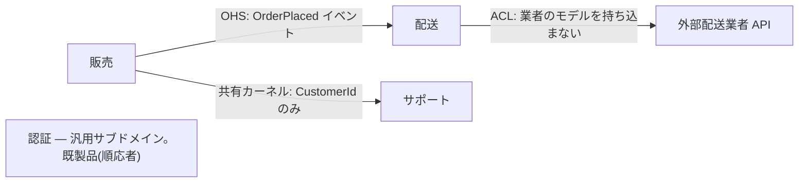

# DDD: 境界づけられたコンテキスト (Bounded Context / Strategic Design)

**どこに線を引き、どこに設計コストをかけるか。** 戦術的なパターン(集約・値オブジェクト・
リポジトリ)は、この線が引けて初めて効く。線を引かないまま戦術だけ適用すると、
「全社で 1 つの巨大な `Customer`」ができあがる。

戦術的設計は
[ddd-domain-object-completeness](../ddd-domain-object-completeness/SKILL.md) /
[ddd-aggregate-repository-boundary](../ddd-aggregate-repository-boundary/SKILL.md) /
[ddd-domain-events](../ddd-domain-events/SKILL.md)。
言葉と境界を業務から発見する進め方は
[ddd-modeling-discovery](../ddd-modeling-discovery/SKILL.md)、
ここでの投資判断(コア/支援/汎用)を既存コードの移行範囲に使う場合は
[ddd-legacy-refactoring](../ddd-legacy-refactoring/SKILL.md)。
コンテキストの内部でモジュールをどう割るかは
[component-design](../component-design/SKILL.md)。

---

## 1. ユビキタス言語 (Ubiquitous Language)

**業務の人が使う言葉と、コードの中の名前を一致させる。** 翻訳表が必要になった時点で、
そのモデルは業務と乖離している。

- **クラス名・メソッド名・イベント名は業務の言葉。** `OrderManager` / `DataProcessor` /
  `handle()` のような技術語は、業務の関心を隠す。`Order.cancel()` / `OrderCancelled`。
- **言語はコンテキストの内側でだけ一貫していればよい。** 全社統一を目指さない
  (第 3 節)。
- **曖昧な言葉は分解のサイン。** 「ステータス」「区分」「フラグ」が何を指すのか
  業務の人ごとに違うなら、そこに複数の概念が潰れている。
- **会話で使われない言葉をコードに持ち込まない。** 逆に、会話で頻出するのにコードに
  存在しない言葉があれば、それはモデルの欠落。

### 用語集を書く

コンテキストごとに用語集(`docs/glossary.md` など)を持つ。1 語 1 行でよい。

```text
| 用語 | 定義 | コード上の名前 |
| 申込 | 顧客が供給契約を申し込んだ状態。まだ供給は開始していない | Application |
| 契約 | 供給開始日が確定した申込 | Contract |
| 解約 | 契約の供給終了が確定した状態。遡及解約を含む | Termination |
```

**定義が書けない語は、まだ概念になっていない。** 書けるまで業務の人と話す。

---

## 2. サブドメイン — どこに投資するか

すべての領域に同じ設計コストをかけるのは間違い。**3 つに分類し、扱いを変える。**

| 種類 | 定義 | 判断 | 実装方針 |
| --- | --- | --- | --- |
| **コアドメイン** | 競合優位の源泉。ここが事業の差 | 「他社と違うのはどこか」 | **DDD をフルに適用する。** 最良の人員を充てる |
| **支援サブドメイン** | 事業に必要だが差別化しない。自社固有ではある | 「必要だが、うまくやっても勝てない」 | 簡素に。CRUD やトランザクションスクリプトで十分 |
| **汎用サブドメイン** | どこの会社にもある(認証・請求・通知・帳票) | 「既製品があるか」 | **買う / 借りる。** 自作しない |

- **DDD は高くつく。** 集約・値オブジェクト・リポジトリ・イベントを全域に適用すると、
  CRUD で済む領域に不釣り合いなコストを払うことになる。
- **コアドメインは 1 つか 2 つ。** 「全部がコア」は分類できていない。
- **時間とともに移る。** かつてのコアが汎用化する(検索・レコメンド)。定期的に見直す。

判定に迷ったら: **「この機能を競合が完全にコピーしたら、事業は困るか。」**
困るならコア、困らないなら支援か汎用。

---

## 3. 境界づけられたコンテキスト

**1 つのモデルが一貫していられる範囲。** その内側では、1 つの言葉が 1 つの意味を持つ。

同じ「顧客」でも、意味は文脈で変わる:

```text
販売コンテキスト   : 顧客 = 与信枠・支払条件・購買履歴を持つ相手
配送コンテキスト   : 顧客 = 住所・受取可能時間帯・不在通知先
サポートコンテキスト: 顧客 = 問い合わせ履歴・契約プラン・優先度
```

**これを 1 つの `Customer` クラスに統合してはいけない。** 統合すると:

- フィールドが 50 個になり、どのユースケースで何が必要か誰にも分からなくなる。
- 販売の変更が配送を壊す。チームが互いにブロックし合う。
- 不変条件が矛盾する(「配送先住所は必須」だが販売では不要、など)。

**同じ id を共有する、別々のモデルでよい。** `CustomerId` だけが共通の参照点。

### 境界の引き方

1. **言葉の意味が変わる境目**を探す。同じ語が違う意味になるところが境界。
2. **業務プロセスの区切り**を見る。担当部署・承認フロー・システム移管のタイミング。
3. **変更理由の違い**を見る。別々の理由で別々の速度で変わるなら、別コンテキスト。
4. **チーム構造**を見る。1 コンテキストの所有者は 1 チーム(逆は成り立つ — 1 チームが
   複数コンテキストを持つのは可)。

**引いてはいけない線:** テーブル単位、画面単位、技術レイヤ単位。
これらは業務の境界ではない。

---

## 4. コンテキストマップ — 関係の型を明示する

コンテキスト間には必ず力関係がある。**それを暗黙にしない。**

| パターン | 内容 | 使いどころ / 注意 |
| --- | --- | --- |
| **共有カーネル** (Shared Kernel) | 一部のモデルを 2 チームで共有 | 変更に両者の合意が要る。**小さく保つ**。安易に使うと結合が広がる |
| **顧客/供給者** (Customer/Supplier) | 下流の要求が上流の計画に入る | 上流に交渉力があるが応じる意思がある場合 |
| **順応者** (Conformist) | 下流が上流のモデルをそのまま受け入れる | 上流が変わらない(外部 SaaS 等)かつ、そのモデルで困らないとき |
| **腐敗防止層** (ACL) | 下流が翻訳層を挟んで自分のモデルを守る | **既定。** 上流のモデルが自分の言葉と違うとき(第 5 節) |
| **公開ホストサービス** (OHS) | 上流が公開プロトコル/API を定義 | 下流が多数いるとき。破壊的変更をバージョンで管理 |
| **別々の道** (Separate Ways) | 統合しない | 統合コストが利益を上回るとき。**有効な選択肢** |

書き方は図でも表でもよいが、**各関係に「上流/下流」と「パターン名」を書く**。



---

## 5. 腐敗防止層 (Anti-Corruption Layer)

**他コンテキスト / 外部システムのモデルを、自分のドメインに持ち込ませない翻訳層。**

外部 API のレスポンス形式、レガシー DB のカラム名、他チームの用語が
自分のドメイン層に染み出すと、**相手の変更が自分の不変条件を壊す**ようになる。

```python
# NG: 外部業者のモデルがドメインに侵入
@dataclass(frozen=True, kw_only=True)
class Shipment(Entity):
    carrier_status_code: str   # ← 業者固有のコード。意味が業者の都合で変わる
    tracking_no: str


# OK: ACL で翻訳し、自分の言葉に直す
class CarrierAcl:
    """外部業者 API を、配送コンテキストの言葉に翻訳する。"""

    def fetch_status(self, tracking: TrackingNumber) -> DeliveryStatus:
        raw = self._client.get_status(tracking.value)   # 業者の形
        return self._translate(raw["status_cd"])        # 自分の形

    def _translate(self, code: str) -> DeliveryStatus:
        match code:
            case "01" | "02":
                return DeliveryStatus.IN_TRANSIT
            case "10":
                return DeliveryStatus.DELIVERED
            case _:
                raise ValueError(f"未知の配送ステータス: {code!r}")
```

- **ACL はインフラ層に置く。** ドメイン層は ACL の**抽象**だけを知る
  (リポジトリと同じ依存性逆転)。
- **翻訳できない値は例外にする。** 黙って `UNKNOWN` に落とすと、相手の仕様変更に
  気付けない。
- **ACL はコストである。** 相手のモデルで本当に困らないなら順応者(Conformist)でよい。
  コアドメインが相手のモデルに汚染される場合にだけ払う価値がある。
- ACL の実装(翻訳、リトライ、タイムアウト、テスト)は
  [adapter-design](../adapter-design/SKILL.md)。

---

## 6. コンテキスト間の統合

**コンテキストをまたぐトランザクションは張らない。** 境界の向こうは結果整合。

- 既定は**ドメインイベントによる非同期連携**
  ([ddd-domain-events](../ddd-domain-events/SKILL.md))。
- **イベントのペイロードは公開契約。** 内部の集約構造をそのまま流さない。
  受け手が必要とする値だけを、安定した名前で入れる。
- **他コンテキストの DB を直接読まない。** テーブルを共有した時点で境界は消える。
  API かイベントを通す。
- **同期呼び出しが必要なら、その相手は同じコンテキストではないか**を疑う。
  「即座に整合していないと不正」なら、境界が間違っている可能性が高い。

```python
# 販売コンテキストが公開するイベント(内部構造を漏らさない)
@dataclass(frozen=True, kw_only=True)
class OrderPlaced(DomainEvent):
    order_id: str          # 内部の値オブジェクトではなくプリミティブ
    customer_id: str
    total_amount: Decimal
    currency: str
    # 内部の OrderLine の構造は公開しない
```

---

## 7. Django プロジェクトへの落とし込み

**1 コンテキスト = 1 Django app**(または app のグループ)を既定にする。

```text
src/
├── sales/                  # 販売コンテキスト(コアドメイン → DDD をフル適用)
│   ├── domain/
│   ├── usecases/
│   ├── infrastructure/
│   └── interfaces/
├── shipping/               # 配送コンテキスト
│   ├── domain/
│   ├── ...
│   └── infrastructure/acl/carrier_acl.py
└── notifications/          # 汎用サブドメイン → 既製品のラッパで十分
```

- **コンテキスト間で `domain/` を import しない。** `sales/domain` が
  `shipping/domain` を import したら、境界が消えている。grep で確認できる形にする。
- **モデル(テーブル)も分ける。** どうしても共有が必要なのは id だけ。
  他コンテキストのテーブルに ForeignKey を張らない(張った時点で結合)。
- **サブドメインの分類に応じて構造を変えてよい。** 汎用サブドメインに
  `domain/usecases/infrastructure` の 4 層を強制しない — 素の Django view + model で十分。
- モジュラモノリスで始めて、境界が安定してから分離を検討する。
  **最初からマイクロサービスに割らない** — 境界を間違えたときの修正コストが跳ね上がる。

---

## アンチパターン

| アンチパターン | なぜ悪いか |
| --- | --- |
| 全社で 1 つの統一モデル(`Customer` が全部入り) | フィールドが際限なく増え、変更が全チームに波及する |
| 全領域に DDD をフル適用 | 支援・汎用にコアと同じコストを払う。差別化に投資できない |
| コアドメインを外注 / 既製品で済ませる | 競合優位の源泉を自社に残せない |
| 汎用サブドメイン(認証・帳票)を自作 | 既製品より良くならない。保守だけが残る |
| コンテキスト間で DB テーブルを共有 | 境界が消える。相手のスキーマ変更で壊れる |
| 他コンテキストのモデルを直接 import | 依存が双方向になり、独立して変更できなくなる |
| 外部 API のモデルをドメインにそのまま流す | 相手の都合で自分の不変条件が壊れる。ACL を挟む |
| コンテキストをまたぐトランザクション | 境界の否定。結果整合(イベント)にする |
| 関係パターンを明示しない | 力関係が暗黙のまま。破壊的変更が予告なく来る |
| 技術レイヤ / テーブル単位で境界を引く | 業務の境界ではない。言葉の意味が変わる線で引く |

---

## ルール(チェックリスト)

- [ ] コンテキストごとに**用語集**があり、コードの名前と一致している
- [ ] コードに技術語ではなく**業務の言葉**が使われている
- [ ] サブドメインを**コア / 支援 / 汎用**に分類した。コアは 1〜2 個に絞れている
- [ ] **DDD をフル適用するのはコアだけ**。支援は簡素に、汎用は買う/借りる
- [ ] 境界を**言葉の意味が変わる線**で引いた(テーブル・画面・技術レイヤで引いていない)
- [ ] 同じ語が別の意味を持つなら、**別コンテキストの別モデル**にした(統一していない)
- [ ] コンテキストマップがあり、各関係に**上流/下流とパターン名**が書かれている
- [ ] 外部システム / 他コンテキストのモデルは **ACL で翻訳**している(コアを守る場合)
- [ ] ACL はインフラ層にあり、翻訳できない値を黙って握り潰していない
- [ ] コンテキスト間は**イベント or API**。DB 共有・直接 import・またぐトランザクションがない
- [ ] イベントのペイロードが**公開契約**として設計されている(内部構造を漏らしていない)
- [ ] 1 コンテキスト = 1 Django app(相当)に対応し、`domain/` の相互 import がない
